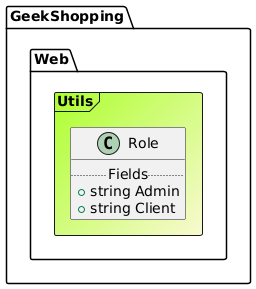
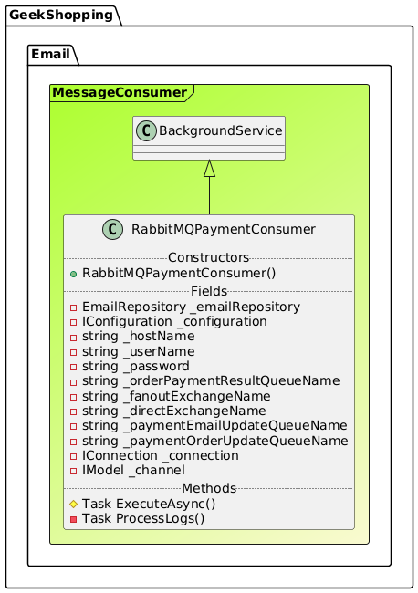

# Projeto: Arquitetura de Microsserviços com .NET 8 e ASP.NET Core

Este repositório implementa uma arquitetura de microsserviços utilizando **.NET 8**, **ASP.NET Core**, **Docker**, **Ocelot** como API Gateway e várias outras ferramentas de integração. O projeto segue as melhores práticas para construção de sistemas escaláveis e descentralizados, ideal para aplicações modernas de alta disponibilidade.

## Sumário

- [Projeto: Arquitetura de Microsserviços com .NET 8 e ASP.NET Core](#projeto-arquitetura-de-microsserviços-com-net-8-e-aspnet-core)
  - [Sumário](#sumário)
  - [Visão Geral](#visão-geral)
  - [Arquitetura](#arquitetura)
  - [Diagrama de classe](#diagrama-de-classe)
    - [Diagrama de classe da camada Web](#diagrama-de-classe-da-camada-web)
      - [Controladores](#controladores)
      - [Modelos](#modelos)
      - [Serviços](#serviços)
      - [Utilitários](#utilitários)
    - [Diagrama de classe da camada de Message Bus](#diagrama-de-classe-da-camada-de-message-bus)
    - [Diagrama de classe da camada de Processador de Pagamentos](#diagrama-de-classe-da-camada-de-processador-de-pagamentos)
    - [Diagrama de classe da API de Carrinho de Compras](#diagrama-de-classe-da-api-de-carrinho-de-compras)
    - [Diagrama de classe da API de Cupons](#diagrama-de-classe-da-api-de-cupons)
    - [Diagrama de classe do Serviço de E-mail](#diagrama-de-classe-do-serviço-de-e-mail)
    - [Diagrama de classe IdentityServer](#diagrama-de-classe-identityserver)
    - [Diagrama de classe da API de Pedidos](#diagrama-de-classe-da-api-de-pedidos)
    - [Diagrama de classe da API de Pagamentos](#diagrama-de-classe-da-api-de-pagamentos)
    - [Diagrama de classe da API de Produtos](#diagrama-de-classe-da-api-de-produtos)
  - [Tecnologias Utilizadas](#tecnologias-utilizadas)
  - [Microsserviços](#microsserviços)
    - [Gateway e Infraestrutura](#gateway-e-infraestrutura)
    - [Serviços](#serviços-1)
  - [Fluxo de Dados e Comunicação](#fluxo-de-dados-e-comunicação)
  - [Autenticação e Autorização](#autenticação-e-autorização)
    - [Provedor de Identidade](#provedor-de-identidade)
  - [Observabilidade e Monitoramento](#observabilidade-e-monitoramento)
  - [Como Executar o Projeto](#como-executar-o-projeto)
    - [Pré-requisitos](#pré-requisitos)
    - [Passo a Passo](#passo-a-passo)
    - [Testando as APIs](#testando-as-apis)
  - [Contribuição](#contribuição)

## Visão Geral

Este projeto é uma implementação de uma arquitetura de microsserviços com foco em **escalabilidade** e **baixa acoplamento entre os serviços**. Ele fornece uma base robusta para construir e gerenciar microsserviços de forma fácil, com comunicação segura, autenticação centralizada e monitoramento integrado.

## Arquitetura


A arquitetura é baseada em **microsserviços desacoplados** que se comunicam através de um **API Gateway** e um **bus de mensagens**. Todos os serviços estão configurados para execução em **containers Docker**, permitindo escalabilidade e facilidade de manutenção.

**Principais componentes**:
- **API Gateway (Ocelot)**: Ponto de entrada para os clientes, roteando as solicitações para os serviços adequados.
- **Microsserviços**: Implementados em .NET 8, cada um responsável por uma parte específica da aplicação.
- **Bus de Mensagens (RabbitMQ)**: Integração e comunicação entre microsserviços.
- **Autenticação**: Centralizada com **IdentityServer4**.
- **Monitoramento e Observabilidade**: Stack de monitoramento para garantir confiabilidade em produção.

## Diagrama de classe

O diagrama de classe representa a estrutura dos microsserviços e a relação entre eles:

### Diagrama de classe da camada Web

Obs.: Possível dar zoom na imagem para melhor visualização.


#### Controladores


#### Modelos


#### Serviços


#### Utilitários




### Diagrama de classe da camada de Message Bus


### Diagrama de classe da camada de Processador de Pagamentos


### Diagrama de classe da API de Carrinho de Compras


### Diagrama de classe da API de Cupons


### Diagrama de classe do Serviço de E-mail





### Diagrama de classe IdentityServer


### Diagrama de classe da API de Pedidos


### Diagrama de classe da API de Pagamentos


### Diagrama de classe da API de Produtos


## Tecnologias Utilizadas

- **ASP.NET Core** (para desenvolvimento de APIs REST)
- **.NET 8** (base para desenvolvimento de serviços)
- **Docker** (para containerização dos serviços)
- **RabbitMQ** (mensageria entre os microsserviços)
- **MySQL** (persistência de dados, gerenciado com MySQL Workbench)
- **IdentityServer4** (provedor de autenticação e autorização centralizado)
- **Ocelot** (API Gateway)
- **Swagger** (documentação das APIs)

## Microsserviços

### Gateway e Infraestrutura

1. **APIGateway**: Implementado com **Ocelot** para centralizar as requisições e roteamento para os microsserviços.
2. **MessageBus**: Serviço de bus de mensagens para comunicação entre microsserviços.
3. **PaymentsProcessor**: Processador de pagamentos responsável por validar e processar transações de pagamento.

### Serviços

1. **CartAPI**: API de gerenciamento de carrinho de compras.
2. **CouponAPI**: API para gerenciamento e validação de cupons de desconto.
3. **Email**: Serviço de envio de e-mails para notificações transacionais.
4. **IdentityServer**: Serviço de autenticação e autorização, utilizando **IdentityServer4**.
5. **OrderAPI**: API de gerenciamento de pedidos.
6. **PaymentAPI**: API de processamento de pagamentos.
7. **ProductAPI**: API de gerenciamento de produtos.

Cada microsserviço possui sua **própria base de dados MySQL** e é independente, garantindo o isolamento de falhas e possibilitando escalabilidade individual.

## Fluxo de Dados e Comunicação

A comunicação entre os serviços ocorre de duas maneiras:

- **APIGateway com Ocelot**: Centraliza o roteamento de requisições HTTP, garantindo que clientes e usuários interajam com uma única API.
- **RabbitMQ**: Facilita a comunicação assíncrona e baseada em eventos entre microsserviços, permitindo desacoplamento e resiliência.

## Autenticação e Autorização

A aplicação utiliza **IdentityServer4** para autenticação centralizada, fornecendo **tokens JWT** para garantir acesso seguro entre microsserviços.

### Provedor de Identidade

1. **Usuários e Funções**: Gerenciamento de usuários e funções para controle de acesso.
2. **Integração com Microsserviços**: Cada microsserviço valida o token JWT para assegurar autenticação e autorização.

## Observabilidade e Monitoramento

Para monitorar e rastrear o sistema em produção, foram implementadas soluções de monitoramento e logging, com possibilidade de integração com ferramentas como Prometheus e Grafana para coleta e visualização de métricas.

## Como Executar o Projeto

### Pré-requisitos

- **Docker e Docker Compose**
- **MySQL Workbench**
- **Visual Studio 2022** ou outra IDE compatível com .NET 8
- **RabbitMQ**

### Passo a Passo

1. Clone o repositório:

    ```bash
        git clone https://github.com/rafaelx0liveira/GeekShopping.git
        cd seu-repositorio
    ```

2. Execute os containers usando Docker Compose:

    ```bash
        docker-compose up -d
    ```

3. Acesse a aplicação no endereço [https://localhost:4430](https://localhost:4430).

### Testando as APIs

Cada microsserviço possui uma documentação com Swagger disponível:

- **APIGateway**: `https://localhost:4480`
- **CartAPI**: `https://localhost:4445/swagger`
- **CouponAPI**: `https://localhost:4450/swagger`
- **Email Service**: `https://localhost:4460/swagger`
- **IdentityServer**: `https://localhost:4435`
- **OrderAPI**: `http://localhost:4455/swagger`
- **PaymentAPI**: `http://localhost:5109/swagger`
- **ProductAPI**: `https://localhost:4440/swagger`

## Contribuição

Contribuições são bem-vindas! Para contribuir:

1. Faça um fork do projeto.
2. Crie uma branch para suas alterações: `git checkout -b minha-feature`.
3. Faça o commit das alterações: `git commit -m 'Minha nova feature'`.
4. Envie para o repositório: `git push origin minha-feature`.
5. Abra um Pull Request para revisão.
