# Project: Microservices Architecture with .NET 8 and ASP.NET Core

This repository implements a microservices architecture using **.NET 8**, **ASP.NET Core**, **Docker**, **Ocelot** as the API Gateway, **IdentityServer4**, and several other integration tools. The project follows best practices for building scalable and decentralized systems, ideal for modern high-availability applications.

## Table of Contents

- [Project: Microservices Architecture with .NET 8 and ASP.NET Core](#project-microservices-architecture-with-net-8-and-aspnet-core)
  - [Table of Contents](#table-of-contents)
  - [Project Overview](#project-overview)
  - [Architecture](#architecture)
  - [Class Diagram](#class-diagram)
    - [Web Layer Class Diagram](#web-layer-class-diagram)
      - [Controllers](#controllers)
      - [Models](#models)
      - [Services](#services)
      - [Utilities](#utilities)
    - [Message Bus Layer Diagram](#message-bus-layer-diagram)
    - [Payments Processor Layer Diagram](#payments-processor-layer-diagram)
    - [Cart API Diagram](#cart-api-diagram)
    - [Coupon API Diagram](#coupon-api-diagram)
    - [Email Service Diagram](#email-service-diagram)
    - [IdentityServer Diagram](#identityserver-diagram)
    - [Order API Diagram](#order-api-diagram)
    - [Payment API Diagram](#payment-api-diagram)
    - [Product API Diagram](#product-api-diagram)
  - [Technologies Used](#technologies-used)
  - [Microservices](#microservices)
    - [Gateway and Infrastructure](#gateway-and-infrastructure)
    - [Services](#services-1)
  - [Data Flow and Communication](#data-flow-and-communication)
    - [Exchange Types](#exchange-types)
  - [Authentication and Authorization](#authentication-and-authorization)
    - [Identity Provider](#identity-provider)
  - [Observability and Monitoring](#observability-and-monitoring)
  - [How to Run the Project](#how-to-run-the-project)
    - [Prerequisites](#prerequisites)
    - [Step-by-Step](#step-by-step)
    - [Testing the APIs](#testing-the-apis)
  - [Contributing](#contributing)

## Project Overview

This project implements a microservices architecture focused on **scalability** and **loose coupling between services**. It provides a solid foundation for building and managing microservices with secure communication, centralized authentication, and integrated monitoring.

## Architecture


The architecture is based on **decoupled microservices** that communicate through an **API Gateway** and a **message bus**.

**Key components**:
- **API Gateway (Ocelot)**: Entry point for clients, routing requests to appropriate services.
- **Microservices**: Built with .NET 8, each responsible for a specific application domain.
- **Message Bus (RabbitMQ)**: Enables integration and communication between services.
- **Authentication**: Centralized via **IdentityServer4**.
- **Monitoring and Observability**: Monitoring stack ensures production reliability.

## Class Diagram

The class diagram shows the structure of the microservices and their relationships:

### Web Layer Class Diagram

Note: Zoom in on the image for better viewing.

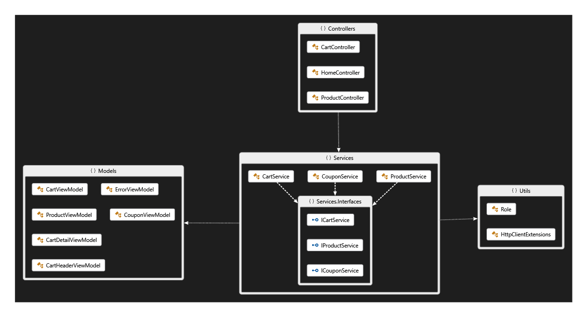

#### Controllers

  
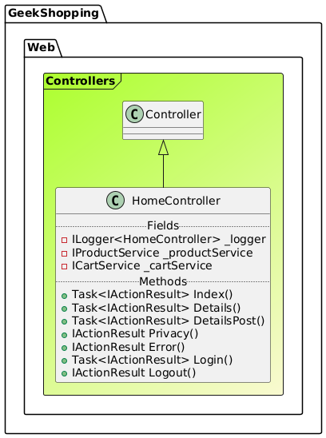  


#### Models

  
  
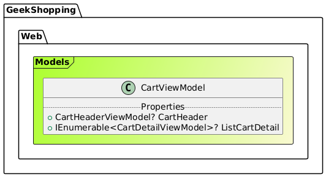  
  
  


#### Services

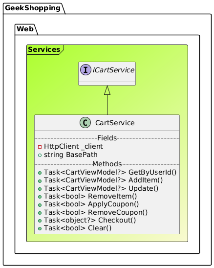  
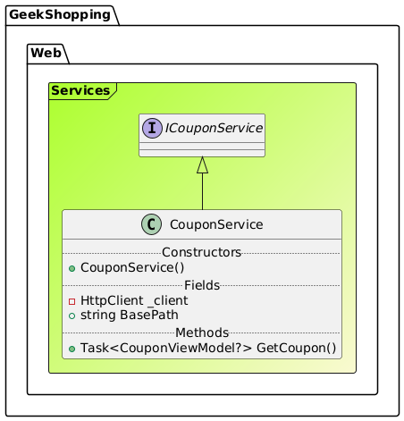  


#### Utilities

  


### Message Bus Layer Diagram


### Payments Processor Layer Diagram

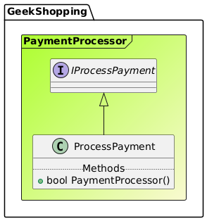

### Cart API Diagram

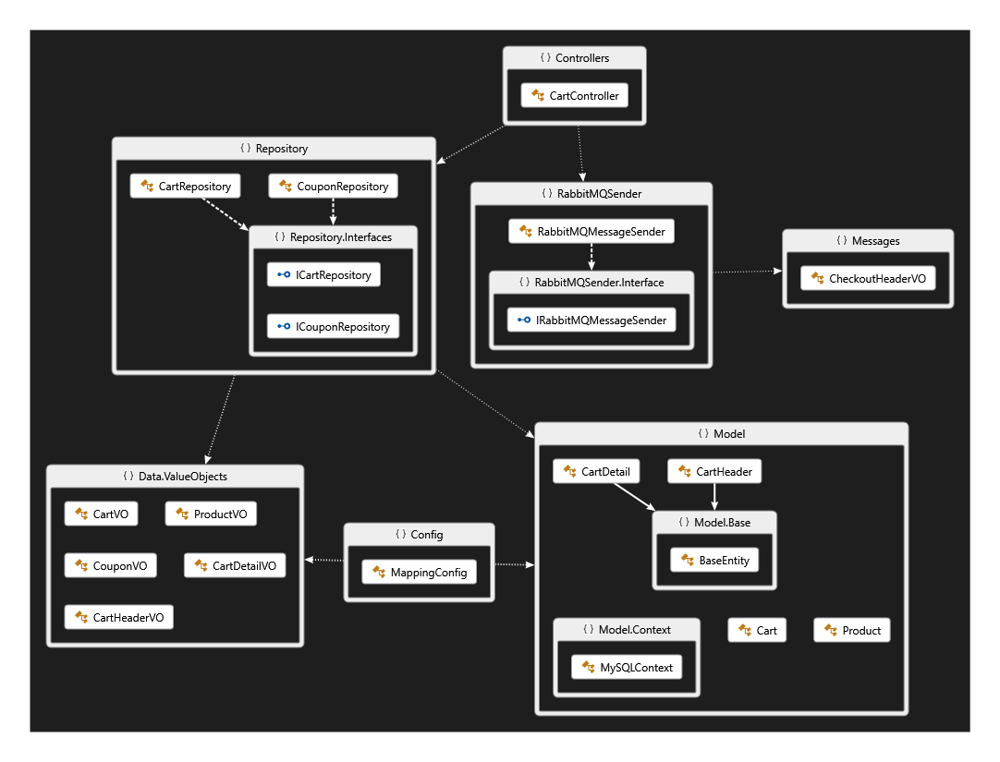  
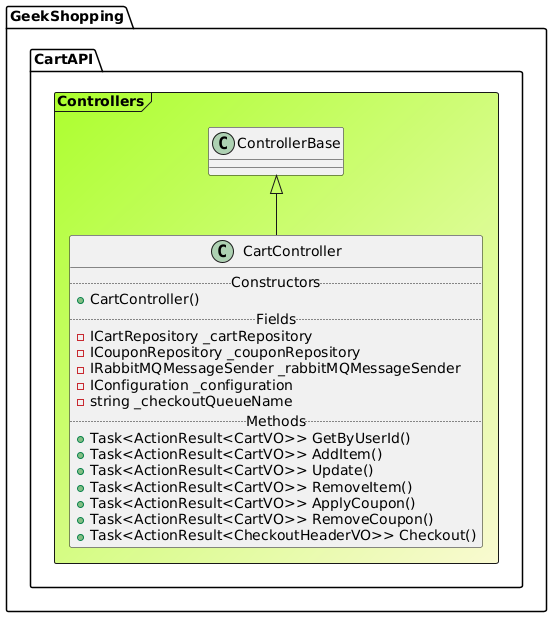  
  
  
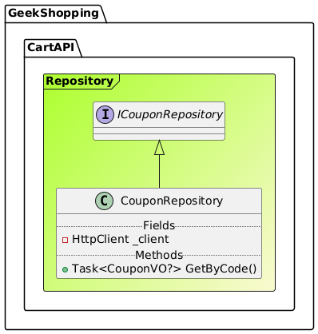

### Coupon API Diagram

  
  


### Email Service Diagram

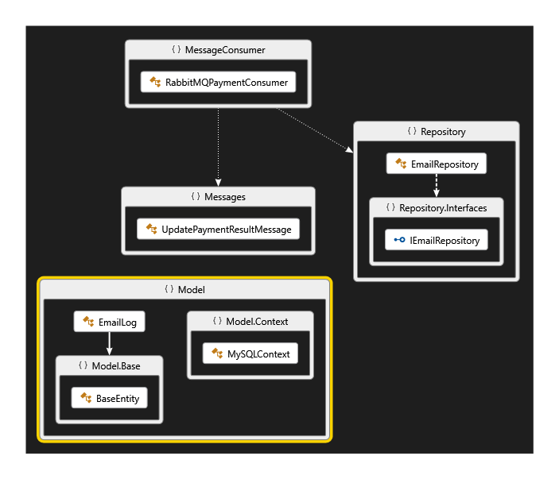  
  
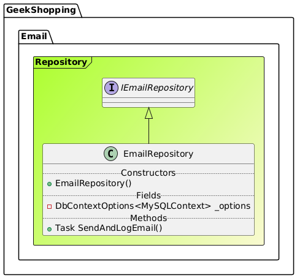

### IdentityServer Diagram


### Order API Diagram

  
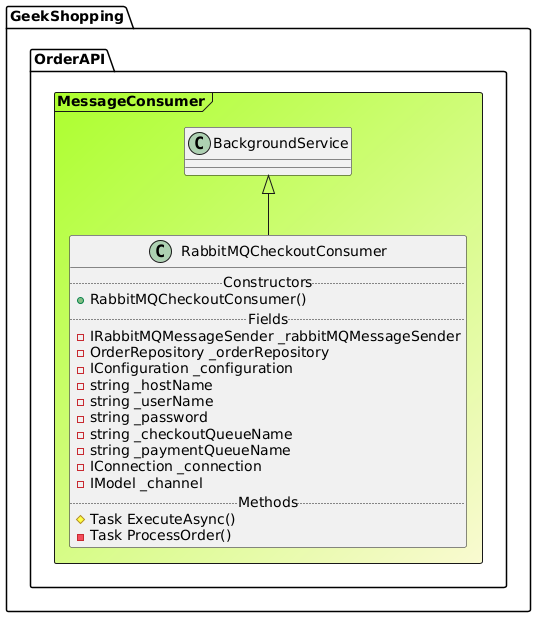  
  
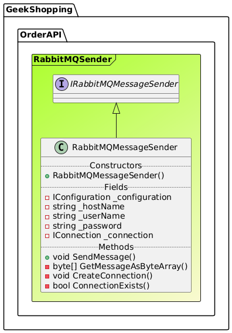  
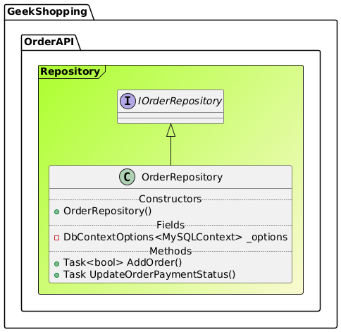

### Payment API Diagram

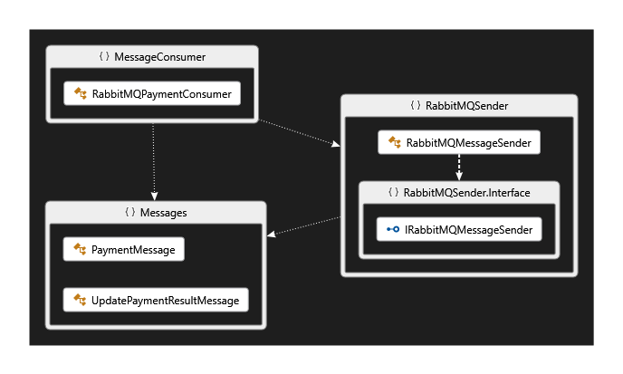  
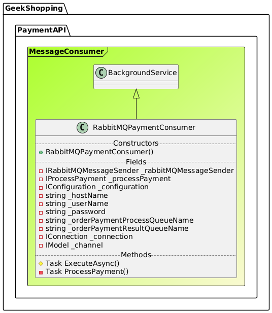  
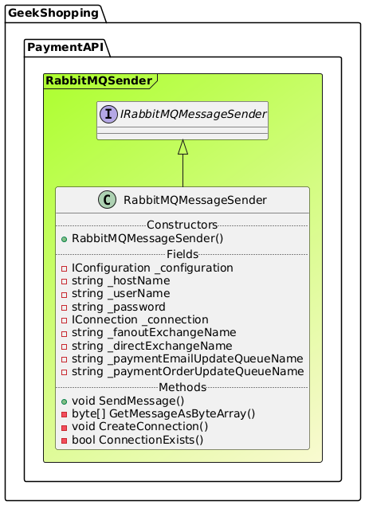

### Product API Diagram

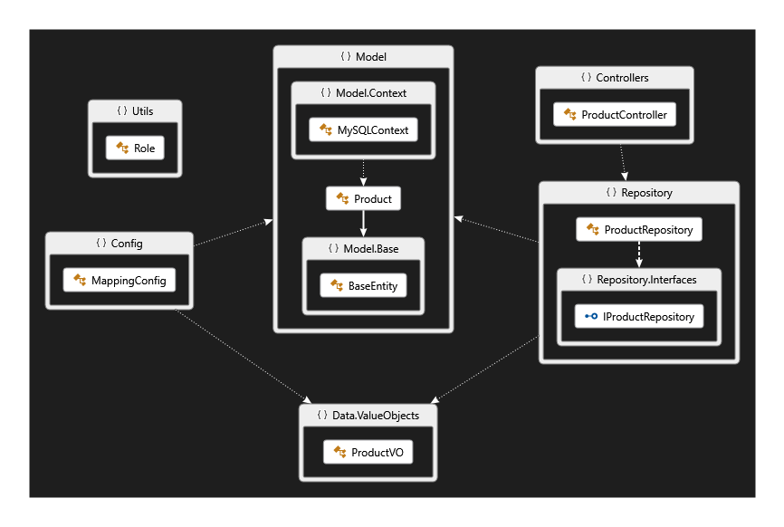  
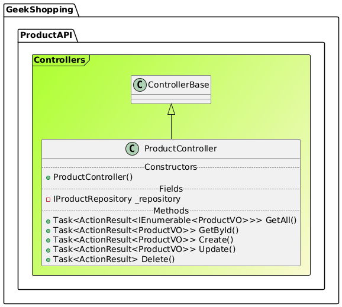  
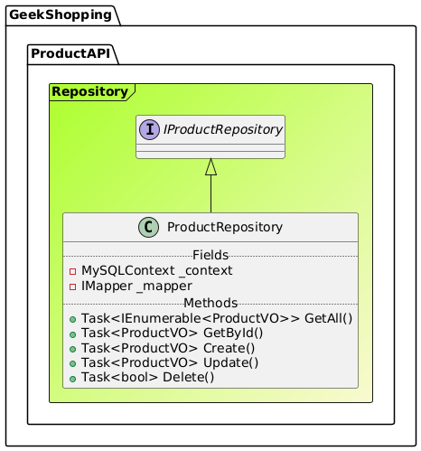

## Technologies Used

- **ASP.NET Core** (for building REST APIs)
- **.NET 8** (service development base)
- **Docker** (to containerize RabbitMQ and services)
- **RabbitMQ** (messaging between services)
- **MySQL** (data persistence, managed with MySQL Workbench)
- **IdentityServer4** (centralized authentication and authorization)
- **Ocelot** (API Gateway)
- **Swagger** (API documentation)

## Microservices

### Gateway and Infrastructure

1. **APIGateway** – Uses **Ocelot** to centralize and route HTTP requests.  
2. **MessageBus** – Message bus service for microservice communication.  
3. **PaymentsProcessor** – Handles payment validation and processing.

### Services

1. **CartAPI** – Manages shopping cart operations.  
2. **CouponAPI** – Manages and validates discount coupons.  
3. **Email** – Sends transactional email notifications.  
4. **IdentityServer** – Authentication and authorization using **IdentityServer4**.  
5. **OrderAPI** – Manages order creation and retrieval.  
6. **PaymentAPI** – Processes payments.  
7. **ProductAPI** – Manages product data.

Each microservice has its **own MySQL database** and is fully independent, ensuring fault isolation and individual scalability.

## Data Flow and Communication

Service communication occurs in two ways:

- **Ocelot API Gateway** – Centralizes and routes HTTP requests, enabling client interaction via a single endpoint.
- **RabbitMQ** – Enables asynchronous, event-driven communication for decoupling and resilience.

### Exchange Types

This project uses two RabbitMQ exchange types for message routing:

1. **Fanout Exchange**  
   - **Description**: Broadcasts messages to all bound queues, ignoring routing keys. Ideal for sending the same message to multiple consumers.
2. **Direct Exchange**  
   - **Description**: Routes messages to queues with exact routing key matches. Useful for targeted message delivery.

## Authentication and Authorization

The system uses **IdentityServer4** for centralized authentication, issuing **JWT tokens** to securely authorize access between services.

### Identity Provider

1. **Users and Roles** – User and role management for access control.  
2. **Microservice Integration** – Each service validates JWT tokens to enforce auth rules.

## Observability and Monitoring

Monitoring and logging are implemented to track system activity in production, with optional integration into tools like Prometheus and Grafana for metrics and dashboards.

## How to Run the Project

### Prerequisites

- **Docker & Docker Compose**
- **MySQL Workbench**
- **Visual Studio 2022** (or compatible .NET 8 IDE)
- **RabbitMQ**

### Step-by-Step

1. Clone the repository:

   ```bash
   git clone https://github.com/rafaelx0liveira/GeekShopping.git
   cd your-repo
   ```

2. Start containers using Docker Compose:

   ```bash
   docker-compose up -d
   ```

3. Access the application at [https://localhost:4430](https://localhost:4430)

### Testing the APIs

Each service provides Swagger documentation:

- **APIGateway**: `https://localhost:4480`
- **CartAPI**: `https://localhost:4445/swagger`
- **CouponAPI**: `https://localhost:4450/swagger`
- **Email**: `https://localhost:4460/swagger`
- **IdentityServer**: `https://localhost:4435`
- **OrderAPI**: `http://localhost:4455/swagger`
- **PaymentAPI**: `http://localhost:5109/swagger`
- **ProductAPI**: `https://localhost:4440/swagger`

## Contributing

Contributions are welcome! To contribute:

1. Fork the project.  
2. Create a feature branch: `git checkout -b my-feature`  
3. Commit your changes: `git commit -m 'My new feature'`  
4. Push to your fork: `git push origin my-feature`  
5. Open a Pull Request for review.

